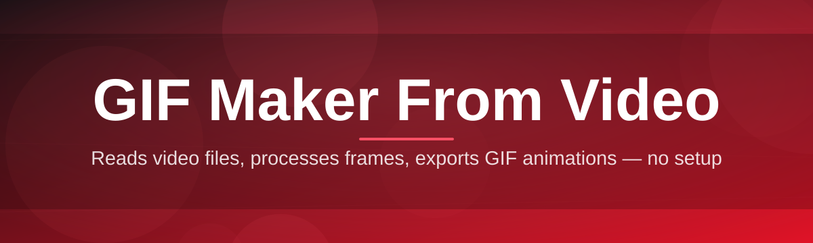
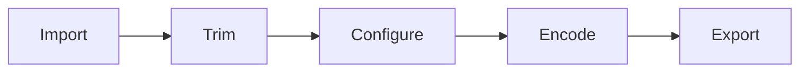

# gif-maker-editor 🎬✨

  

*Turn any video clip into a polished, share-ready GIF in the time it takes to brew a cup of tea.*

  

## 📋 Before You Dive In

Here's the quick-glance table — check this first so there are no surprises later:

| Requirement | Details |
|---|---|
| **Operating System** | Windows 10 (64-bit) or Windows 11 |
| **Disk Space** | ~150 MB free for the app, plus room for your exports |
| **RAM** | 4 GB minimum, 8 GB recommended for longer clips |
| **Dependencies** | None — it's a standalone build, nothing extra to install |
| **Internet** | Only needed once, to download the app |
| **Input Formats** | MP4, MOV, AVI, MKV, WEBM |
| **Output Format** | Optimized GIF (with optional APNG/WEBP export) |

> [!NOTE]
> No runtime installers, no background services, no hidden dependencies. You download one package, you run it, you're making GIFs.

---

## 🌍 Overview

Let's start with the "why." Somewhere between a screenshot and a full video sits the humble GIF — looping, silent, universally playable, and endlessly shareable across chats, forums, and social feeds. But turning a video into a *good* GIF (not a blurry, oversized, laggy one) has traditionally meant wrestling with command-line tools, sketchy web uploaders, or bloated editing suites that weren't built for this one specific job. **gif-maker-editor** exists to close that gap: it's a focused, desktop-native GIF Maker from Video that treats the conversion process as a craft, not an afterthought.

This project is for streamers clipping highlight reels, developers documenting UI bugs, meme-makers chasing the perfect loop, teachers building quick visual explainers, and anyone who's ever thought "I just want to turn this 10-second clip into a GIF without losing my afternoon." Rather than forcing you through a maze of codecs and export dialogs, gif-maker-editor gives you a trimmed-down, visual workflow: load a video, mark your in/out points, tweak a few sliders, and export. That's the whole idea.

Under the hood, we care a lot about the stuff most people never think about — frame interpolation, palette optimization, and file-size-to-quality tradeoffs — so you don't have to. The goal has always been the same since this project started: make GIF creation from video feel less like an engineering task and more like a creative one.

  

---

## 🔥 What Makes This Thing Tick

- **Frame-Accurate Trimming** — Scrub through your video frame by frame and lock in the exact moment your GIF should begin and end, no guesswork involved.

- **Smart Palette Engine** — Instead of a generic 256-color dump, the palette generator analyzes your clip's actual color distribution to keep gradients smooth and banding minimal.

- **Live Preview Canvas** — Every adjustment — speed, crop, filter — renders instantly in a looping preview panel, so what you see is genuinely what you export.

- **Batch Conversion Queue** — Drop in a folder of clips, set your export profile once, and let the queue chew through all of them while you do something else.

- **Text & Sticker Overlay** — Add captions, timestamps, or simple stickers directly onto your GIF timeline, with drag-to-position and basic animation-in/out.

- **Size-Target Compression** — Tell it "I need this under 8 MB for Discord" and the encoder works backward from that target, balancing resolution and frame rate automatically.

- **Speed Ramping** — Slow down a punchline or speed up a boring stretch, with independent speed curves per selected segment.

- **Crop & Aspect Presets** — One-click presets for square, portrait, and widescreen exports tuned for common social platforms.

> [!TIP]
> If your GIF looks a little "muddy" after export, try nudging the palette size down before touching the resolution — color depth is usually the bigger culprit than pixel count.

---

## 🚀 How to Get Started

  

Follow along, it's genuinely quick:

1. **Visit the landing page** using the button above — that's the only place this tool is distributed from.
2. **Download the Windows package** and save it somewhere you'll remember, like your Downloads folder.
3. **Run the application** — no setup wizard, no extra components to fetch, it opens straight into the editor.
4. **Load your video, trim it, tweak your export settings, and hit Export.** Your GIF lands right where you told it to.

> [!IMPORTANT]
> Because this is a standalone executable, Windows SmartScreen may show a first-run notice for unrecognized publishers. That's expected for indie tools distributed outside the Microsoft Store — click "More info" and proceed if you trust the source.

---

## 🖥️ System Requirements

| Component | Minimum | Recommended |
|---|---|---|
| OS | Windows 10 (64-bit) | Windows 11 |
| CPU | Dual-core, 2.0 GHz | Quad-core, 3.0 GHz+ |
| RAM | 4 GB | 8 GB+ |
| GPU | Integrated graphics | Dedicated GPU for faster preview rendering |
| Storage | 150 MB app + export space | SSD recommended for large batch jobs |

> [!NOTE]
> There are no external dependencies to manage — no runtime frameworks, no separate codec packs. Everything the encoder needs ships inside the app itself.

---

## ⚙️ How It Works

The pipeline behind gif-maker-editor is intentionally simple to reason about, even though there's real optimization happening under the surface:

1. **Import** — The video is decoded and its metadata (duration, frame rate, resolution) is read.
2. **Select** — You mark the start and end points of the segment you actually want.
3. **Configure** — Frame rate, resolution, palette, and overlays are set through the editor panel.
4. **Encode** — Frames are extracted, optimized, and compressed into the final GIF (or APNG/WEBP).
5. **Export** — The finished file is written to your chosen folder, ready to share.

---

## 🧩 Troubleshooting Corner

<strong>My exported GIF looks blocky or pixelated — what happened?</strong>

This is almost always a palette or resolution mismatch. Try increasing the palette color count slightly, or lower the output resolution rather than the frame rate — motion clarity usually matters more than raw pixel density for GIFs.

<strong>The file size is way bigger than I expected.</strong>

Frame rate is the biggest size driver. Dropping from 30fps to 15fps often cuts file size dramatically with minimal visible loss for typical clip lengths. The size-target compression option can also do this balancing for you automatically.

<strong>Audio isn't included in my export — is that a bug?</strong>

No — that's expected behavior. GIF as a format has no audio channel at all. If you need sound, export as a short video clip instead using the alternate output modes.

<strong>The app won't open after downloading.</strong>

Double-check you downloaded the Windows package from the official landing page and that antivirus software hasn't quarantined the file. Restoring it from quarantine usually resolves this immediately.

<strong>My video source won't import.</strong>

Confirm the format is one of the supported types (MP4, MOV, AVI, MKV, WEBM). Oddly muxed or corrupted files sometimes need a quick re-encode elsewhere before they'll load cleanly.

> [!WARNING]
> Extremely long source videos (over ~20 minutes) may take a while to index on first import. This is normal — grab a coffee, it only happens once per file.

---

## 🎨 UI / UX Details

The interface leans minimal on purpose — big preview, focused controls, nothing shouting for your attention.

**Keyboard Shortcuts:**

| Action | Shortcut |
|---|---|
| Play / Pause Preview | `Space` |
| Set In Point | `I` |
| Set Out Point | `O` |
| Export | `Ctrl + E` |
| Undo / Redo | `Ctrl + Z` / `Ctrl + Y` |
| Zoom Timeline | `Ctrl + Scroll` |

**Themes:** Light and Dark modes ship out of the box, switchable from the settings gear — the app remembers your last choice between sessions.

**Settings Panel:** Default export presets, output folder location, and palette behavior can all be saved as your personal defaults, so repeat exports need zero reconfiguration.

> [!TIP]
> Hold `Shift` while dragging the trim handles for frame-by-frame precision instead of the default coarse scrubbing.

---

## 🤝 Contributing & Community

This project grows because people like you show up with ideas, bug reports, and the occasional "what if it also did *this*" suggestion.

- Found something odd? Open an issue describing what you expected versus what happened.
- Have a feature idea? Discussions are the right place to float it before building anything.
- Want to contribute code or documentation? Pull requests are welcome — small, focused changes are easiest to review and merge.

  

> Every popular tool started as somebody's weekend itch that people kept coming back to scratch. Thanks for being part of that.

---

## 📜 License

Released under the [MIT License](LICENSE), 2026. Use it, modify it, build on top of it — just carry the license notice along.

---

## ⚠️ Disclaimer

gif-maker-editor is provided "as is," without warranty of any kind. You're responsible for the content you create and share with it, including respecting copyright on any source video material you convert. The tool processes files locally on your machine and does not claim ownership over your exports.

  